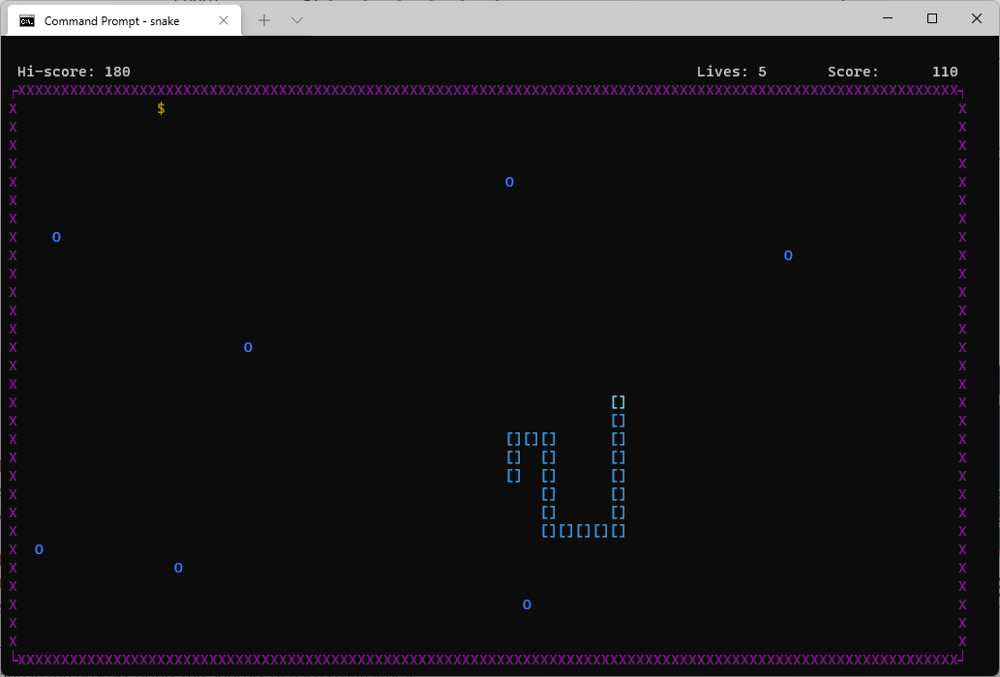

## Snake game

This is a snake game made in C using ANSI escape sequences and some Windows Console API calls for terminal control. 

**Background:**

I decided not to use ncurses library because it would probably be overkill for this project and because not everyone wants to install it. Also, I decided against using functions from conio.h because it is pretty much deprecated and not portable. 

Instead, I relied upon ANSI escape sequences and some Windows Console API calls. Starting from Windows 10 version 1511, ANSI escape sequences are supported in Windows Console and Windows Terminal supports them by default. So, anyone with a recent release of Windows 10 or with Windows 11 should be able to run this game.

**Game features:**
-  snake's position on the screen is stored in three separate structures, the head, the body and the tail. The body only stores coordinates when a snake changes direction, so not every coordinate is stored
- the game uses alternate screen buffer to switch back and forth between game menu and main screen
- different types of food are available with modifiers which appear at random intervals
- the game features ASCII intro graphics

**Limitations:**
- the graphics will be messed up if the console window is resized during the game (this is an easy fix but I didn't consider it important for this release)
- the game menu is not yet fully implemented, although core functionality exists
#
**Cloning or downloading the repository:**

If you have git installed you can clone the repository using the following command: `git clone https://github.com/pmatkov/Snake-game`. If not, you can download a zip file of the repository (code/ download ZIP).

**Compiling and running:**
- this game can be compiled in MS Visual Studio or in Mingw/ MSYS environment
- to compile in MS Visual Studio put all .c files in source folder and .h files in header folder and select `build` from the menu
- to compile in Mingw/ Msys environment type the following command at the terminal: `make` (build prerequisites: *gcc* and *make*)
- to start the game just type `snake` at the terminal

**Playing the game:**
- use arrow keys to control snake's movement
- ESC opens a menu
- space bar pauses the game
 
Anyone is welcome to contribute to this project. Feel free to contact me via GitHub for suggestions and ideas.
