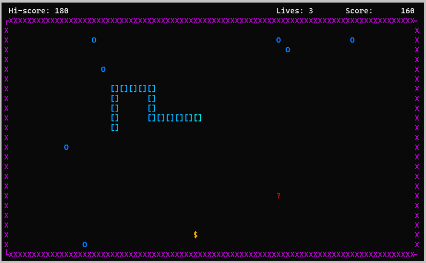

## Snake game

This is a snake game made in C using Windows API calls for terminal control (Windows 10 or 11 is necessary to play)

**Background:**

After deciding to make this game (a long overdue project), I had to tackle the problem of terminal control to achieve the classic look of this game in GUI-like console application. 

The options on table were *ncurses* library, which is now probably a standard way to implement a portable solution, *conio* library from the old days of MS-DOS compilers and Windows API. It seemed there are plenty of resources online how to create a console game with `ncurses` library but not many how to do that with Windows API. I was up for a challenge so I decided not to use *ncurses*, and instead use just Windows API calls with ANSI escape sequences (these sequences are supported since Windows 10 version 1511).

**Game features:**
-  snake's position on the screen is stored in three separate structures, the head, the body and the tail. The body only stores coordinates when a snake changes direction, so not every coordinate is stored
- the game uses alternate screen buffer to switch back and forth between game menu and main screen
- different types of food are available with modifiers which appear at random intervals
- the game features ASCII intro graphics

**Limitations:**
- the graphics will be messed up if the console window is resized during the game (this is an easy fix but I didn't consider it important for this release)
- the game menu is not yet fully implemented, although core functionality exists
#
**Cloning or downloading the repository:**

If you have git you can clone this repository by typing the following command at the terminal: `git clone https://github.com/pmatkov/Snake-game`. If not, you can download a zip file of the repository (code/ download ZIP).

**Compiling and running:**
- this game can be compiled in MS Visual Studio or in Mingw/ MSYS environment
- to compile in MS Visual Studio put all .c files in the source folder and .h files in the header folder and select `build` from the menu
- to compile in Mingw/ Msys environment type the following command at the terminal: `make` (build prerequisites: *gcc* and *make*)
- to start the game type `snake` at the terminal

**Playing the game:**
- use arrow keys to control snake's movement
- ESC opens a menu
- space bar pauses the game
 
Anyone is welcome to contribute to this project. Feel free to contact me via GitHub for suggestions and ideas.
